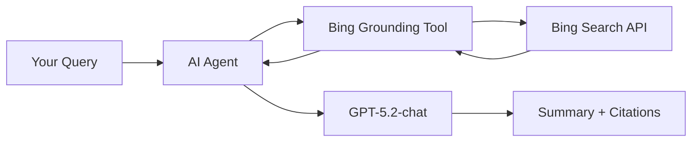

<!--
---
name: Web Summarization with Bing Grounding and GPT-5.2-chat
description: Build an intelligent web research assistant using Azure AI Foundry Projects Agents with Bing Grounding
page_type: sample
languages:
- python
- bicep
- azdeveloper
products:
- azure-ai-foundry
- azure-openai
- bing-search
- azure
- ai
urlFragment: web-summarization-bing-gpt-python
---
-->

# Web Summarization with Bing Grounding and GPT-5.2-chat

Build an intelligent web research assistant that searches the web and provides comprehensive, up-to-date summaries using **Azure AI Foundry Projects Agents** with **Bing Grounding** and **GPT-5.2-chat**.

## What You'll Build

This solution enables you to:

🔍 **Search the Web**: Use Bing Grounding to search for current information across the internet  
🤖 **AI-Powered Summarization**: Leverage GPT-5.2-chat to generate comprehensive summaries  
📚 **Citation Tracking**: Automatically capture and display source URLs from search results  
⚡ **Streaming Responses**: Get real-time results as the AI agent processes information

### Example Query

```bash
python query.py "who won the Oklahoma City thunder game on 12/2/2025?"
```

The assistant will search the web using Bing, analyze the results, and provide a detailed summary with citations.

## Quick Start

### Prerequisites

- Python 3.11 or later
- Azure subscription
- Azure Developer CLI (`azd`)

### 1. Deploy Azure Infrastructure

Deploy all required Azure resources with a single command:

```bash
azd up
```

This provisions:
- 🤖 **Azure AI Foundry Project** - AI development environment
- 🧠 **Azure OpenAI** - GPT-5.2-chat model deployment
- 🔍 **Bing Search API** - Web grounding capabilities
- 📊 **Monitoring** - Application Insights and Log Analytics
- 💾 **Storage** - Backing storage for AI Foundry
- 🔐 **Identity** - Managed identity for secure access

### 2. Install Python Dependencies

```bash
pip install -r requirements.txt
```

Required packages:
- `azure-ai-projects` - Azure AI Foundry SDK
- `azure-identity` - Azure authentication
- `python-dotenv` - Environment configuration
- `openai` - OpenAI API client

### 3. Run Your First Query

```bash
# Use the default query
python query.py

# Or provide your own
python query.py "what are the latest developments in AI?"
```

**Sample Output:**
```
================================================================================
Web Summarization with Bing Grounding and GPT-5.2-chat
================================================================================
Query: who won the Oklahoma City thunder game on 12/2/2025?
================================================================================

Agent is researching...
The Oklahoma City Thunder defeated the New Orleans Pelicans 119-109...

Citations:
  - https://www.espn.com/...
  - https://www.nba.com/...

✅ Processing complete!
```  


## How It Works

This solution uses **Azure AI Foundry Projects Agents** with the **Bing Grounding** tool to create an intelligent web research assistant.

### Architecture Overview



### Key Components

#### 🤖 **Azure AI Foundry Projects Agents**
The core orchestration layer that manages the AI agent lifecycle:
- **Agent Creation**: Dynamically creates agents with specific instructions
- **Tool Integration**: Configures agents with Bing Grounding capabilities
- **Streaming Responses**: Provides real-time results as they're generated
- **Resource Management**: Automatically cleans up agent versions after use

#### 🔍 **Bing Grounding Tool**
Gives the AI agent access to current web information:
- **Web Search**: Searches across the internet for relevant information
- **Grounding**: Ensures responses are based on actual search results
- **Citation Tracking**: Automatically captures source URLs
- **Current Information**: Access to the latest web content

#### 🧠 **GPT-5.2-chat Model**
The latest GPT model optimized for conversation and summarization:
- **Advanced Understanding**: Better context comprehension
- **Comprehensive Summaries**: Detailed, accurate summaries
- **Citation Integration**: Incorporates sources naturally
- **Efficient Processing**: Faster response times

### Interaction Flow

1. **Query Submission**: User submits a search query
2. **Agent Creation**: System creates an agent with Bing Grounding tool
3. **Web Search**: Agent uses Bing to search for relevant information
4. **Content Analysis**: GPT-5.2-chat analyzes search results
5. **Summary Generation**: Agent generates comprehensive summary
6. **Citation Extraction**: URLs are extracted and displayed
7. **Cleanup**: Agent resources are automatically cleaned up

### Azure Infrastructure

The solution deploys these Azure resources:

| Resource | Purpose |
|----------|---------|
| **AI Foundry Hub** | Central management for AI projects |
| **AI Foundry Project** | Development workspace for AI agents |
| **Azure OpenAI** | Hosts GPT-5.2-chat model deployment |
| **Bing Search API** | Provides web search grounding |
| **Application Insights** | Monitors performance and usage |
| **Storage Account** | Backing storage for AI Foundry |
| **Managed Identity** | Secure authentication between services |

## Customization

### Modifying the Agent Instructions

Edit the agent instructions in [query.py](query.py) to change how the agent behaves:

```python
agent = project_client.agents.create_version(
    agent_name="WebResearcher",
    definition=PromptAgentDefinition(
        model=deployment,
        instructions="You are a helpful research assistant. Use Bing search to find current information and provide a comprehensive summary.",
        # Customize instructions here
        tools=[...],
    ),
    ...
)
```

### Using Different Models

Change the model in your `.env` file:

```env
GPT52_CHAT_DEPLOYMENT_NAME=gpt-52-chat  # or another model
```

### Adjusting Search Configuration

Modify the Bing Grounding configuration in [query.py](query.py):

```python
BingGroundingAgentTool(
    bing_grounding=BingGroundingSearchToolParameters(
        search_configurations=[
            BingGroundingSearchConfiguration(
                project_connection_id=bing_conn_id
                # Additional search parameters
            )
        ]
    )
)
```

## Configuration

### Environment Variables

After running `azd up`, your `.env` file will be populated with:

| Variable | Description |
|----------|-------------|
| `AI_PROJECT_NAME` | Azure AI Foundry project name |
| `AZURE_LOCATION` | Azure region for deployment |
| `AZURE_SUBSCRIPTION_ID` | Your Azure subscription |
| `AZURE_RESOURCE_GROUP` | Resource group name |
| `GPT52_CHAT_DEPLOYMENT_NAME` | GPT model deployment name |
| `BING_CONNECTION_ID` | Bing Search connection ID |
| `BING_CONNECTION_API_KEY` | Bing Search API key |

### Azure Resources

The deployment creates these resources in your subscription:

```
Resource Group
├── AI Foundry Hub
├── AI Foundry Project
│   ├── OpenAI Connection
│   └── Bing Grounding Connection
├── Azure OpenAI Account
│   └── GPT-5.2-chat Deployment
├── Bing Search API
├── Application Insights
├── Log Analytics Workspace
├── Storage Account
└── Managed Identity
```

## Next Steps: Building Your AI Agent Ecosystem

### 🚀 Extend Your Agent Capabilities

1. **Add Custom Tools**: Create tools specific to your business domain
2. **Enterprise Integration**: Connect agents to your databases, APIs, and systems  
3. **Multi-Agent Support**: Scale to support multiple agents with different capabilities
4. **Advanced Analytics**: Monitor agent usage and optimize tool performance

### 🧠 Agent Development Patterns

**Data Access Agents**: Give agents read access to enterprise data
```python
# Example: Customer lookup tool for sales agents
@app.generic_trigger(toolName="get_customer", description="Look up customer information")
def get_customer(context):
    # Connect to CRM, database, etc.
    return customer_data
```

**Action Agents**: Let agents perform tasks and workflows
```python  
# Example: Ticket creation tool for support agents
@app.generic_trigger(toolName="create_ticket", description="Create support ticket")
def create_ticket(context):
    # Integrate with ticketing system
    return ticket_id
```

**Analysis Agents**: Provide agents with computational capabilities
```python
# Example: Financial analysis tool for finance agents  
@app.generic_trigger(toolName="calculate_roi", description="Calculate ROI for investments")
def calculate_roi(context):
    # Complex calculations, ML models, etc.
    return analysis_results
```

### 📚 Additional Resources

- **[TESTING.md](TESTING.md)** - Complete testing and validation guide
- **[MCP Specification](https://modelcontextprotocol.io/)** - Official Model Context Protocol documentation
- **[Azure AI Gateway](https://github.com/Azure-Samples/AI-Gateway)** - Learn more about AI Gateway patterns
- **[Sequence Diagrams](infra/app/apim-oauth/diagrams/diagrams.md)** - Detailed interaction flows

### 🤝 Contributing

This is an experimental sample showing AI agent integration patterns. Contributions and feedback are welcome as we explore the future of AI agent development with Azure and MCP.