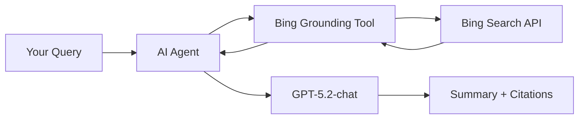

<!--
---
name: Web Summarization with Bing Grounding and GPT-5.2-chat
description: Build an intelligent web research assistant using Azure AI Foundry Projects Agents with Bing Grounding
page_type: sample
languages:
- python
- bicep
- azdeveloper
products:
- azure-ai-foundry
- azure-openai
- bing-search
- azure
- ai
urlFragment: web-summarization-bing-gpt-python
---
-->

# Web Summarization with Bing Grounding and GPT-5.2-chat

Build an intelligent web research assistant that searches the web and provides comprehensive, up-to-date summaries using **Azure AI Foundry Projects Agents** with **Bing Grounding** and **GPT-5.2-chat**.

## What You'll Build

This solution enables you to:

🔍 **Search the Web**: Use Bing Grounding to search for current information across the internet  
🤖 **AI-Powered Summarization**: Leverage GPT-5.2-chat to generate comprehensive summaries  
📚 **Citation Tracking**: Automatically capture and display source URLs from search results  
⚡ **Streaming Responses**: Get real-time results as the AI agent processes information

### Example Query

```bash
python query.py "who won the Oklahoma City thunder game on 12/2/2025?"
```

The assistant will search the web using Bing, analyze the results, and provide a detailed summary with citations.

## Quick Start

### Prerequisites

- Python 3.11 or later
- Azure subscription
- Azure Developer CLI (`azd`)

### 1. Deploy Azure Infrastructure

Deploy all required Azure resources with a single command:

```bash
azd up
```

This provisions:
- 🤖 **Azure AI Foundry** - Unified AI Services account with built-in project
- 🧠 **GPT-5.2-chat Model** - Latest GPT model deployment
- 🔍 **Bing Grounding** - Web search capabilities with automatic connection
- 🎯 **Agents Capability** - Built-in agents runtime for AI orchestration

### 2. Install Python Dependencies

```bash
pip install -r requirements.txt
```

Required packages:
- `azure-ai-projects` - Azure AI Foundry SDK
- `azure-identity` - Azure authentication
- `python-dotenv` - Environment configuration
- `openai` - OpenAI API client

### 3. Run Your First Query

```bash
# Use the default query
python query.py

# Or provide your own
python query.py "what are the latest developments in AI?"
```

**Sample Output:**
```
================================================================================
Web Summarization with Bing Grounding and GPT-5.2-chat
================================================================================
Query: who won the Oklahoma City thunder game on 12/2/2025?
================================================================================

Agent is researching...
The Oklahoma City Thunder defeated the New Orleans Pelicans 119-109...

Citations:
  - https://www.espn.com/...
  - https://www.nba.com/...

✅ Processing complete!
```  


## How It Works

This solution uses **Azure AI Foundry Projects Agents** with the **Bing Grounding** tool to create an intelligent web research assistant.

### Architecture Overview



### Key Components

#### 🤖 **Azure AI Foundry Agents**
The core orchestration layer built into Azure AI Foundry:
- **Agent Creation**: Dynamically creates agents with specific instructions
- **Tool Integration**: Configures agents with Bing Grounding capabilities
- **Streaming Responses**: Provides real-time results as they're generated
- **Resource Management**: Automatically cleans up agent versions after use

#### 🔍 **Bing Grounding Tool**
Gives the AI agent access to current web information:
- **Web Search**: Searches across the internet for relevant information
- **Grounding**: Ensures responses are based on actual search results
- **Citation Tracking**: Automatically captures source URLs
- **Current Information**: Access to the latest web content

#### 🧠 **GPT-5.2-chat Model**
The latest GPT model optimized for conversation and summarization:
- **Advanced Understanding**: Better context comprehension
- **Comprehensive Summaries**: Detailed, accurate summaries
- **Citation Integration**: Incorporates sources naturally
- **Efficient Processing**: Faster response times

### Interaction Flow

1. **Query Submission**: User submits a search query
2. **Agent Creation**: System creates an agent with Bing Grounding tool
3. **Web Search**: Agent uses Bing to search for relevant information
4. **Content Analysis**: GPT-5.2-chat analyzes search results
5. **Summary Generation**: Agent generates comprehensive summary
6. **Citation Extraction**: URLs are extracted and displayed
7. **Cleanup**: Agent resources are automatically cleaned up

### Azure Infrastructure

The solution deploys these Azure resources:

| Resource | Purpose |
|----------|---------|
| **Azure AI Foundry** | Unified AI Services account with built-in project |
| **GPT-5.2-chat Deployment** | Latest GPT model for summarization |
| **Bing Grounding** | Web search API with project-level connection |
| **Agents Capability** | Built-in agents runtime for orchestration |

## Customization

### Modifying the Agent Instructions

Edit the agent instructions in [query.py](query.py) to change how the agent behaves:

```python
agent = project_client.agents.create_version(
    agent_name="WebResearcher",
    definition=PromptAgentDefinition(
        model=deployment,
        instructions="You are a helpful research assistant. Use Bing search to find current information and provide a comprehensive summary.",
        # Customize instructions here
        tools=[...],
    ),
    ...
)
```

### Using Different Models

Change the model in your `.env` file:

```env
GPT52_CHAT_DEPLOYMENT_NAME=gpt-52-chat  # or another model
```

### Adjusting Search Configuration

Modify the Bing Grounding configuration in [query.py](query.py):

```python
BingGroundingAgentTool(
    bing_grounding=BingGroundingSearchToolParameters(
        search_configurations=[
            BingGroundingSearchConfiguration(
                project_connection_id=bing_conn_id
                # Additional search parameters
            )
        ]
    )
)
```

## Configuration

### Environment Variables

After running `azd up`, your `.env` file will be populated with:

| Variable | Description |
|----------|-------------|
| `AI_PROJECT_NAME` | Azure AI Foundry account name |
| `AZURE_LOCATION` | Azure region for deployment |
| `AZURE_SUBSCRIPTION_ID` | Your Azure subscription ID |
| `AZURE_RESOURCE_GROUP` | Resource group name |
| `AZURE_AI_PROJECT_ENDPOINT` | Project endpoint URL for API access |
| `AZURE_AI_MODEL_DEPLOYMENT_NAME` | GPT model deployment name |
| `BING_PROJECT_CONNECTION_ID` | Full resource ID for Bing connection |
| `BING_CONNECTION_NAME` | Bing connection name |
| `BING_CONNECTION_API_KEY` | Bing Search API key |

### Azure Resources

The deployment creates these resources in your subscription:

```
Resource Group
└── Azure AI Foundry (AIServices)
    ├── Default Project (proj-default)
    │   └── Bing Grounding Connection
    ├── GPT-5.2-chat Deployment
    ├── Agents Capability Host
    └── Bing Grounding API
```

## Code Walkthrough

### Main Components

#### 1. Agent Creation ([query.py](query.py))

```python
agent = project_client.agents.create_version(
    agent_name="WebResearcher",
    definition=PromptAgentDefinition(
        model=deployment,
        instructions="You are a helpful research assistant...",
        tools=[BingGroundingAgentTool(...)],
    ),
    description="Web research assistant with Bing grounding",
)
```

Creates an agent version with:
- Custom instructions for research behavior
- Bing Grounding tool configuration
- GPT-5.2-chat model specification

#### 2. Streaming Response Processing

```python
stream_response = openai_client.responses.create(
    stream=True,
    input=query,
    extra_body={"agent": {"name": agent.name, "type": "agent_reference"}},
)

for event in stream_response:
    if event.type == "response.output_text.delta":
        print(event.delta, end="", flush=True)
```

Processes events in real-time:
- `response.created` - Response initialized
- `response.output_text.delta` - Incremental text chunks
- `response.output_text.done` - Text generation complete
- `response.output_item.done` - Extract citations

#### 3. Citation Extraction

```python
if annotation.type == "url_citation":
    citations.append(f"  - {annotation.url}")
```

Automatically captures source URLs from search results.

#### 4. Resource Cleanup

```python
project_client.agents.delete_version(agent.name, agent.version)
```

Removes agent version after completion to manage resources.

## Troubleshooting

### Common Issues

**Error: "Project endpoint not found"**
- Ensure `azd up` completed successfully
- Check `.env` file has `AZURE_AI_PROJECT_ENDPOINT` set
- Verify you're authenticated: `az login`

**Error: "Deployment not found"**
- Confirm GPT-5.2-chat model is deployed
- Check `GPT52_CHAT_DEPLOYMENT_NAME` matches deployment name
- Verify model is available in your region

**Error: "Bing connection not found"**
- Ensure Bing Search API was provisioned
- Check `BING_CONNECTION_ID` in `.env`
- Verify connection exists in AI Foundry portal

**Slow responses**
- Normal for first request (cold start)
- Subsequent requests should be faster
- Check Application Insights for performance metrics

### Monitoring

View logs and metrics in Azure Portal:
1. Navigate to your AI Foundry Project
2. Select **Monitoring** > **Application Insights**
3. View **Logs** for detailed traces
4. Check **Metrics** for performance data

## Cost Considerations

Estimated monthly costs (with moderate usage):

| Resource | Estimated Cost |
|----------|----------------|
| Azure OpenAI (GPT-5.2-chat) | $50-200/month |
| Bing Search API | $7-20/month |
| AI Foundry Project | Free tier available |
| Application Insights | $2-10/month |
| Storage Account | < $1/month |

**Cost optimization tips:**
- Monitor usage in Azure Portal
- Set up cost alerts
- Use appropriate model capacity (SKU)
- Clean up resources when not in use: `azd down`

## Additional Resources

- **[Azure AI Foundry Documentation](https://learn.microsoft.com/azure/ai-studio/)** - Complete platform guide
- **[Azure OpenAI Documentation](https://learn.microsoft.com/azure/ai-services/openai/)** - Model capabilities
- **[Bing Search API Documentation](https://learn.microsoft.com/bing/search-apis/)** - Search capabilities
- **[Azure AI SDK for Python](https://learn.microsoft.com/python/api/overview/azure/ai-projects-readme)** - SDK reference

## Contributing

This sample demonstrates web summarization with Azure AI Foundry. Contributions and feedback are welcome!

## License

This project is licensed under the MIT License - see the LICENSE file for details.