<!--
---
name: Building AI Agents with Azure API Management and Model Context Protocol
description: Build scalable AI Agents using Azure API Management as the AI Gateway for MCP Servers with Azure Functions  
page_type: sample
languages:
- python
- bicep
- azdeveloper
products:
- azure-api-management
- azure-functions
- azure
- ai
urlFragment: ai-agents-apim-mcp-functions-python
---
-->

# Building AI Agents with Azure API Management and Model Context Protocol


Build powerful AI Agents that can access enterprise tools and data through the **Model Context Protocol (MCP)**. This sample demonstrates how to use **Azure API Management** as an intelligent [AI Gateway](https://github.com/Azure-Samples/AI-Gateway) to create scalable, secure MCP servers that your AI agents can interact with.

## What You'll Build

This solution enables you to:

🤖 **Create AI Agent Tools**: Build custom tools that AI agents can discover and use  
🔧 **Extend Agent Capabilities**: Give agents access to enterprise systems, databases, and APIs  
🌐 **Scale Agent Infrastructure**: Deploy MCP servers that handle multiple concurrent agent sessions  
🛡️ **Secure Agent Access**: Implement proper authentication and authorization for agent interactions  

### Available MCP Tools

The sample includes three ready-to-use agent tools:

| Tool             | Purpose                  | AI Agent Use Case                                 |
|------------------|--------------------------|---------------------------------------------------|
| `hello_mcp`      | Simple greeting tool     | Test agent connectivity and basic tool calling    |
| `save_snippet`   | Store code/text snippets | Let agents save information for later retrieval   |
| `get_snippet`    | Retrieve stored snippets | Enable agents to access previously saved data     |

This architecture follows the latest [MCP Authorization specification](https://modelcontextprotocol.io/specification/2025-03-26/basic/authorization#2-10-third-party-authorization-flow) and provides a [detailed sequence diagram](infra/app/apim-oauth/diagrams/diagrams.md) of the agent interaction flow.

## Quick Start: Deploy Your AI Agent Backend

Get your AI agent infrastructure running in minutes:

1. **Register Azure Resource Provider** (one-time setup)
    ```bash
    # Using Azure CLI
    az provider register --namespace Microsoft.App --wait
    
    # Using Azure PowerShell  
    Register-AzResourceProvider -ProviderNamespace Microsoft.App
    ```

2. **Deploy the Complete Solution**
    ```bash
    azd up
    ```
    
    This single command provisions:
    - 🏗️ Azure API Management (AI Gateway)
    - ⚡ Azure Functions (MCP Tools Runtime)  
    - 💾 Storage Account (Agent Data Persistence)
    - 🔐 Authentication & Authorization
    - 📊 Monitoring & Logging

## Connect Your AI Agent

### Option 1: Use MCP Inspector (Interactive Testing)

Perfect for development and testing your agent tools:

1. **Launch MCP Inspector**
    ```bash
    npx @modelcontextprotocol/inspector
    ```

2. **Connect to Your Agent Backend**
   - Open the MCP Inspector web app (e.g. http://127.0.0.1:6274/#resources)
   - Set transport type to `SSE`
   - Enter your APIM endpoint: `https://<your-apim-service>.azure-api.net/mcp/sse`
   - Click **Connect**

3. **Interact with Agent Tools**
   - Click **List Tools** to see available capabilities
   - Select any tool (e.g., `hello_mcp`) and click **Run Tool**
   - Test agent tool responses and behavior

### Option 2: Automated Testing & Integration

For CI/CD and automated validation of your agent backend:

```bash
python test_mcp_fixed_session.py
```

This comprehensive test validates your AI agent infrastructure:
- 🔗 **Agent Connectivity**: MCP session establishment via SSE
- 🛠️ **Tool Discovery**: Agent can find available tools (`tools/list`)
- 🚀 **Tool Execution**: Agent can successfully call tools and get responses
- 📡 **Real-time Communication**: Streaming responses via Server-Sent Events

**Expected Agent Test Results:**
```
🤖 AI Agent Backend Validation
| Component             | Status          |
|-----------------------|-----------------|
| 🔗 Agent Session      | ✅ CONNECTED   |
| 🛠️ Tool Discovery     | ✅ SUCCESS     |
| 🚀 Tool Execution     | ✅ SUCCESS     |
| 📊 Agent Backend      | 🎉 READY       |
```

📖 **Detailed Testing Guide**: See [TESTING.md](TESTING.md) for complete testing instructions, troubleshooting, and integration examples.  


## AI Agent Architecture Overview

This solution creates a scalable, enterprise-ready backend for AI agents using the Model Context Protocol (MCP). Azure API Management acts as an intelligent AI Gateway that enables agents to discover, authenticate with, and execute tools across your organization.


### How AI Agents Interact with Your Backend

```mermaid
graph TB
    A[🤖 AI Agent] --> B[🌐 Azure API Management<br/>AI Gateway]
    B --> C[⚡ Azure Functions<br/>MCP Tools Runtime]
    C --> D[💾 Azure Storage<br/>Agent Data]
    C --> E[🔧 Your Enterprise APIs<br/>Databases, Services]
    
    B --> F[🔐 Authentication<br/>OAuth 2.0 + PKCE]
    B --> G[📊 Monitoring<br/>Agent Usage Analytics]
```



**Agent Interaction Flow:**
1. 🤖 **Agent Discovery**: AI agent connects to your MCP server endpoint
2. 🔍 **Tool Discovery**: Agent queries available tools (`tools/list`)
3. 🚀 **Tool Execution**: Agent calls specific tools with parameters (`tools/call`)
4. 📡 **Real-time Responses**: Agent receives results via streaming responses
5. 🧠 **Agent Learning**: Agent incorporates tool results into its reasoning

### Azure Infrastructure for AI Agents

The solution automatically provisions these Azure resources to support your AI agents:

#### 🌐 AI Gateway Layer
- **Azure API Management (APIM)** - Smart routing and management for AI agent requests
  - **Agent Authentication**: OAuth 2.0/PKCE flow for secure agent access
  - **Tool Discovery**: Exposes MCP protocol endpoints for agent tool discovery  
  - **Rate Limiting**: Prevents agent abuse and manages costs
  - **Analytics**: Tracks agent usage patterns and tool popularity

#### ⚡ Agent Tool Runtime  
- **Azure Functions** - Serverless execution of MCP tools for agents
  - **Python 3.11 Runtime**: Fast startup and execution for agent tool calls
  - **Auto-scaling**: Handles multiple concurrent agent sessions
  - **Custom Tools**: Easy to extend with your own agent capabilities
  - **Integration Ready**: Connect to databases, APIs, and enterprise systems

#### 💾 Agent Data Persistence
- **Azure Storage Account** - Persistent storage for agent data and tool state
  - **Blob Storage**: Store files, documents, and large data that agents can access
  - **Tool State**: Maintain context between agent sessions
  - **Secure Access**: Managed identity integration for secure data access

#### 🔐 Security & Identity (Enterprise-Ready)
- **Managed Identity**: Passwordless authentication between Azure services
- **Entra ID Integration**: Enterprise SSO and user management
- **Network Security**: Optional VNet isolation for sensitive agent workloads

#### 📊 Agent Monitoring
- **Application Insights**: Monitor agent tool usage, performance, and errors
- **Log Analytics**: Detailed logging of agent interactions and tool executions
- **Dashboards**: Track agent adoption and tool effectiveness

### Why This Architecture for AI Agents?

**🌐 Azure API Management as AI Gateway**
- **Agent Onboarding**: Simplified connection process for AI agents
- **Tool Governance**: Control which tools agents can access
- **Usage Analytics**: Understand how agents use your tools
- **Cost Management**: Rate limiting and usage monitoring
- **Multi-Agent Support**: Handle requests from multiple AI agents simultaneously

**⚡ Azure Functions for Agent Tools**
- **Pay-per-Use**: Only pay when agents actually use tools
- **Instant Scaling**: Handle sudden spikes in agent activity
- **Language Flexibility**: Write tools in Python, JavaScript, C#, Java, etc.
- **Enterprise Integration**: Easy connections to existing systems and data

**🔧 Model Context Protocol (MCP) Benefits**
- **Standardized Interface**: Any MCP-compatible agent can use your tools
- **Tool Discovery**: Agents automatically discover available capabilities
- **Streaming Responses**: Real-time communication for better agent experience
- **Extensible**: Add new tools without changing agent code

## Extending Your AI Agent Capabilities

### Adding Custom Tools for Your Agents

The solution is designed for easy extension. Here's how to add your own agent tools:

#### 1. Create a New Tool Function

Add a new function to `src/function_app.py`:

```python
@app.generic_trigger(
    arg_name="context",
    type="mcpToolTrigger", 
    toolName="get_weather",
    description="Get current weather for a location",
    toolProperties='[{"propertyName": "location", "propertyType": "string", "description": "City name"}]',
)
def get_weather(context) -> str:
    """Get weather data for AI agents"""
    args = json.loads(context)["arguments"]
    location = args.get("location", "Seattle")
    
    # Your weather API integration here
    weather_data = call_weather_api(location)
    
    return f"Weather in {location}: {weather_data}"
```

#### 2. Deploy and Test

```bash
# Deploy your new tool
azd deploy

# Test with agents
python test_mcp_fixed_session.py
```

Your AI agents will automatically discover and can use your new `get_weather` tool!

### Common Agent Tool Patterns

| Tool Type           | Example                                  | Agent Use Case                  |
|---------------------|------------------------------------------|---------------------------------|
| **Data Retrieval**  | `get_customer_info`, `search_documents`  | Agents access enterprise data   |
| **Actions**         | `send_email`, `create_ticket`            | Agents perform tasks            |
| **Calculations**    | `calculate_roi`, `forecast_sales`        | Agents do complex math          |
| **External APIs**   | `get_weather`, `translate_text`          | Agents use third-party services |

## Technical Implementation Details

### API Management Configuration for AI Agents

The APIM instance exposes two key APIs for AI agent interaction:

#### 🔐 Agent Authentication API (`/oauth/*`)

Handles secure agent authentication and authorization:

**Key Endpoints for Agent Authentication:**
- `GET /authorize` - Initiates agent authentication flow
- `POST /token` - Exchanges authorization codes for agent access tokens  
- `POST /register` - Dynamic client registration for new agents
- `GET /.well-known/oauth-authorization-server` - Agent discovery of auth capabilities

#### 🤖 Agent Tool API (`/mcp/*`)

The core MCP protocol endpoints that agents use to interact with your tools:

**Agent Session Endpoint** (`GET /sse`)
- Establishes persistent connection between agent and your MCP server
- Enables real-time streaming responses for better agent experience
- Handles multiple concurrent agent sessions

**Agent Tool Interaction** (`POST /message`)  
- `tools/list` - Agent discovers available tools and their capabilities
- `tools/call` - Agent executes specific tools with parameters
- Real-time responses streamed back to agent via SSE connection

### Enterprise Security for AI Agents

The solution includes comprehensive security without compromising agent experience:

**🔐 Agent Authentication**
- OAuth 2.0/PKCE flow ensures only authorized agents can access tools
- Enterprise SSO integration via Entra ID
- Support for multiple agent types and use cases

**🛡️ Tool Access Control**  
- Fine-grained permissions for different agent capabilities
- Rate limiting to prevent agent abuse
- Audit logging of all agent tool interactions

**🔒 Data Protection**
- Encrypted communication between agents and tools
- Secure storage of agent data and tool state
- Network isolation options for sensitive workloads

**📊 Monitoring & Compliance**
- Complete audit trail of agent activities
- Performance monitoring and alerting
- Usage analytics for governance and optimization

## Next Steps: Building Your AI Agent Ecosystem

### 🚀 Extend Your Agent Capabilities

1. **Add Custom Tools**: Create tools specific to your business domain
2. **Enterprise Integration**: Connect agents to your databases, APIs, and systems  
3. **Multi-Agent Support**: Scale to support multiple agents with different capabilities
4. **Advanced Analytics**: Monitor agent usage and optimize tool performance

### 🧠 Agent Development Patterns

**Data Access Agents**: Give agents read access to enterprise data
```python
# Example: Customer lookup tool for sales agents
@app.generic_trigger(toolName="get_customer", description="Look up customer information")
def get_customer(context):
    # Connect to CRM, database, etc.
    return customer_data
```

**Action Agents**: Let agents perform tasks and workflows
```python  
# Example: Ticket creation tool for support agents
@app.generic_trigger(toolName="create_ticket", description="Create support ticket")
def create_ticket(context):
    # Integrate with ticketing system
    return ticket_id
```

**Analysis Agents**: Provide agents with computational capabilities
```python
# Example: Financial analysis tool for finance agents  
@app.generic_trigger(toolName="calculate_roi", description="Calculate ROI for investments")
def calculate_roi(context):
    # Complex calculations, ML models, etc.
    return analysis_results
```

### 📚 Additional Resources

- **[TESTING.md](TESTING.md)** - Complete testing and validation guide
- **[MCP Specification](https://modelcontextprotocol.io/)** - Official Model Context Protocol documentation
- **[Azure AI Gateway](https://github.com/Azure-Samples/AI-Gateway)** - Learn more about AI Gateway patterns
- **[Sequence Diagrams](infra/app/apim-oauth/diagrams/diagrams.md)** - Detailed interaction flows

### 🤝 Contributing

This is an experimental sample showing AI agent integration patterns. Contributions and feedback are welcome as we explore the future of AI agent development with Azure and MCP.